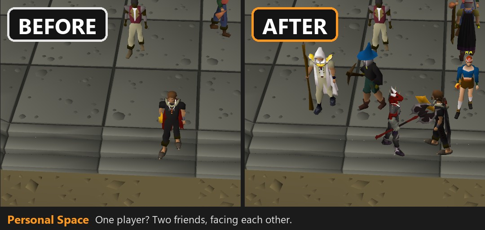
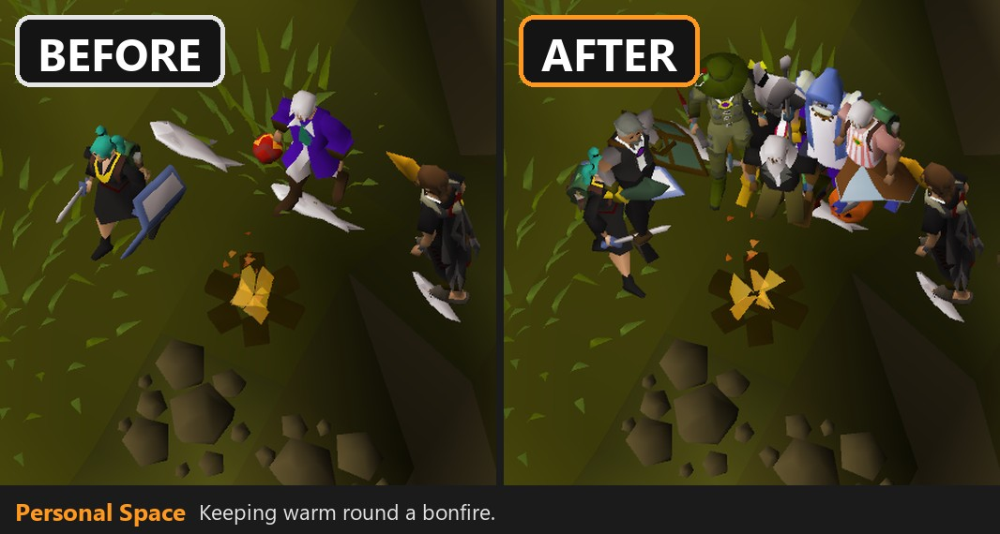
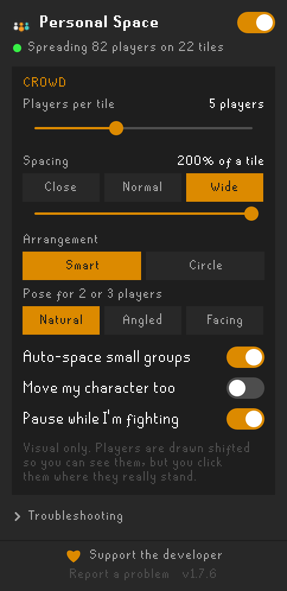
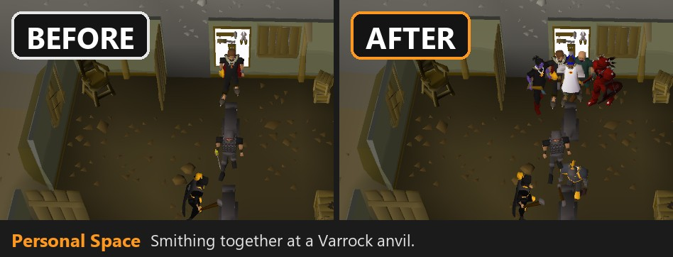
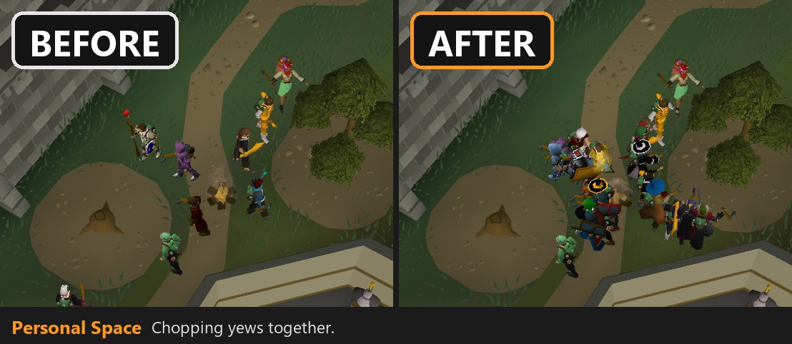
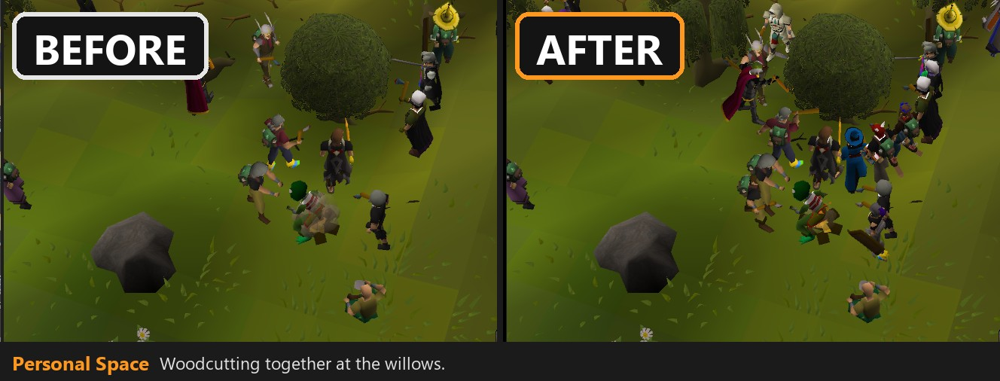
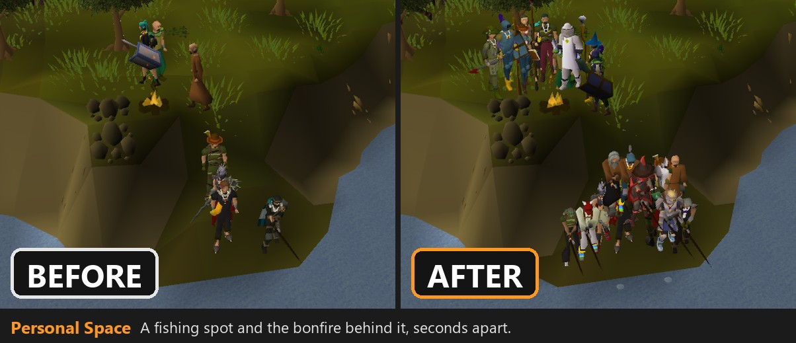
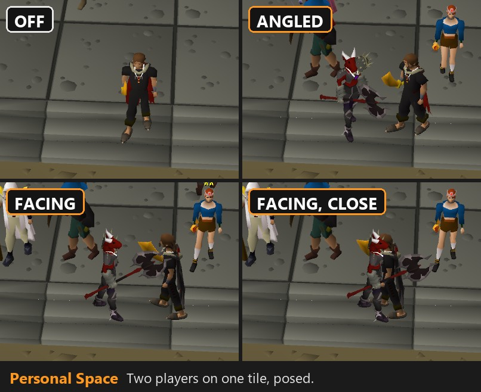
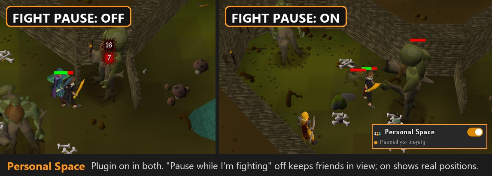

# Personal Space

**See the whole crowd.** When several players stand on the same tile, Old School RuneScape only
draws one of them, so a packed bank, the Grand Exchange, an anvil or a campfire looks half empty.
Personal Space brings everyone back into view and gives them a little room, so every player and
every outfit can be seen. Often it isn't a big crowd at all: the one player you saw by the fire
turns out to be four friends hanging out.






[](https://buy.stripe.com/aFafZg9ehaaxaVaf3e00000)



## What it does

- **Shows the players the game hides.** Stacked players are drawn again, spread out around their tile.
- **Smart arrangement.** Crowds spread out around their tile, never into a bank booth, stall, anvil
  or wall, and line up side by side at things people face. Small groups stay close together; big
  crowds get more room.
- **Players walk into place** with their own walk animation.
- **Pose small groups.** Two or three players in the open can be angled towards each other like a
  photo, or turned to face each other, for the perfect fashionscape screenshot. **Line** and **Arc**
  draw any crowd up in a row or a curve wherever they're standing, for a group shot.
- **At an anvil, range or fire**, players form a curve around it and all face it, so nobody ends
  up hitting thin air. A crowd gathered round a fire stays close and faces the fire, whichever side of it they
  end up on. Two players share the space in front of it evenly; extra players fill the
  curve outwards, then stand in the gaps of a second row behind.
- **At a bank counter or along a riverbank**, players line up side by side along the edge, close
  together, like a busy bank rather than a queue. Neighbouring tiles share one line: a busy
  fishing spot fills the water's edge first, then stands in tidy rows just behind it, even when a couple of them are busy casting spells or trading. Around a fire they stay close too. Turn **Auto-space** off and the Spacing slider sets those distances instead, so you can push a group right out for a photo.
- **Calm crowds.** Everyone keeps their own spot when people come and go. A spot is held for a few
  seconds for someone who steps away, and only players at the back move forward to fill a gap.
  When a crowd shrinks to one player, they step back to the middle of their tile.
- **Groups side by side don't merge.** On a busy square, groups on neighbouring tiles each keep
  to their own side of the ground between them, so nobody is drawn inside anybody else. A group
  makes room by sliding over or closing up together, keeping its shape, and eases back out a few
  seconds after its neighbours leave. Someone who only pauses for a moment on the way past isn't
  made room for, and nobody makes room for players the game isn't showing.
- **Visual only.** Players are drawn shifted so you can see them, but nobody's real position
  changes: you click, trade and follow them where they really stand, and names, chat and minimap
  dots stay put.
- **Safe by design.** Switches itself off in the Wilderness, in PvP areas, on PvP-type worlds, in
  PvP minigames such as Castle Wars, Soul Wars and Last Man Standing, and (unless you turn it off)
  while you're fighting.
  It never shows players the game itself (or another plugin such as Entity Hider) keeps hidden,
  and they never push anyone else aside.

Needs the **GPU** plugin (or 117 HD) turned on.

<br clear="right">

## In game











### Posing a pair or a group




### While you're fighting



## Using it

Click the **Personal Space** button on RuneLite's right-hand toolbar.

| Setting | What it does |
| --- | --- |
| On/off switch | Spread out crowds, or show the game as normal. The lines under the title say what's happening right now, for example "Spreading 7 players on 3 tiles" and "You're in a row along the counter or wall". |
| Players per tile | How many players on one tile get their own spot: 2 to 16, with 5 as the sweet spot. Raise it if a busy bank booth leaves a heap of people in the middle; the higher it goes, the further out the crowd reaches to make room. |
| Spacing | Close, Normal (a tile apart) or Wide (two tiles apart, the default), or drag the slider. With **Auto-space** on, bank counters, walls and fires stay closer on their own; turn it off and the slider sets the distance everywhere. Changes show live. |
| Arrangement | **Smart**: a line along whatever people are facing - a counter, a wall, an anvil, a fire - and a ring out in the open, where there's nothing to line up along. **Circle**: always a ring. **Line**: side by side anywhere, even in the open. **Arc**: a curve, like the crowd round an anvil. |
| Pose for 2 or 3 players | **Natural**: the way they really face. **Angled**: turned halfway towards each other. **Facing**: towards each other. Players at an anvil, booth or fire keep facing it. |
| Auto-space | On: the plugin picks sensible distances whatever the Spacing slider says, so groups of 2 or 3 stay close together and people at a bank counter, a wall or a fire stand shoulder to shoulder. Turn it off to unlock the slider: it then sets how far apart everyone stands, handy for photos, though a tight spot or a big crowd on one tile can still keep people closer. |
| Move my character too | Off: you stay put and others step around you. On: you take a spot too, and people who'd stand between you and the camera step aside when there's somewhere free. Once you've settled you keep your place in your group as people come and go, though the group can widen, tighten or slide over a little to make room for people next to it. |
| Pause while I'm fighting | On (the default): everyone is shown where they really stand while you fight, and for a few seconds after. Keep it on for raids and group bosses, where standing on the same tile matters. Turn it off to keep seeing the crowd during ordinary fights like training or slayer. |
| Show sidebar button | On (the default): Personal Space has a button in the sidebar with its settings and a live status. Off: no button, for a tidy sidebar; every setting is still in the plugin's configuration. |
| Troubleshooting | What Personal Space is doing right now, test mode, live checks and a **Copy report** button for bug reports. |

If crowds aren't spreading, open **Troubleshooting**: the status at the top says why (for example
the GPU plugin is off, or you're in a PvP area) and what to do.

## Support the developer

Personal Space is free, and it will stay free. If it made your world feel busier, here's how to
help it keep improving:

- **[Tip the developer](https://buy.stripe.com/aFafZg9ehaaxaVaf3e00000)** through Stripe. Any amount helps.
- **Star this repository** on GitHub so more players find it.
- **Share screenshots** of a busy world with Personal Space on.
- **Report a problem** or suggest an idea in [Issues](https://github.com/grant9008/personal-space/issues).
  Pressing **Copy report** under Troubleshooting and pasting it in helps a lot.

## How it works

The game adds players to the scene every frame, and when several stand still in the exact middle
of one tile it only adds the first. Personal Space sits in front of the GPU renderer
(`DrawCallbacks`): when the game draws that first player, it also draws the others on the tile at
their spots, using each player's own current model, animation and facing.

To make sure it only ever draws players the game is willing to show (and never, say, an invisible
moderator), it watches RuneLite's render callback, which only sees players the game has already
decided to draw. Players stacked behind someone are briefly let through one at a time to be
confirmed; the frame looks identical while this happens.

Everything is public RuneLite API. No reflection, nothing saved about other players, nothing sent
anywhere.

### Known limits

- **Spell and emote graphics** (for example High Alchemy) still appear at the middle of the tile.
- Players busy with an emote or action (sitting, smithing) slide into place instead of walking, so their action isn't interrupted.
- If **Entity Hider** hides every relevant player, the status may wrongly turn red.
- Players past the "players per tile" limit stay hidden in the middle, as in the normal game.

## Development

- **Run Dev Client.bat**, or in IntelliJ the **Run Dev Client** configuration, starts RuneLite with the plugin loaded.
- **Check Build.bat** compiles and runs the unit tests.
- Java 11. `.github/workflows/build.yml` builds on every push.

```
src/main/java/com/grant9008/personalspace/
  PersonalSpacePlugin.java      plugin entry: safety rules, per-tick layout, sidebar updates
  SpreadingDrawCallbacks.java   sits in front of the renderer; draws players at their spots
  StackProbe.java               confirms players are ones the game is willing to draw
  CrowdPlanner.java             per tick: which tiles are spread and who stands where
  StackSpreader.java            the spots on a tile: rings, curved rows, straight counter rows
  ShapeMemory.java              keeps a tile's row or crowd shape while the same people are there
  SlotBook.java                 keeps everyone's spot as people come and go
  CollisionTerrain.java         where a player can stand, from the game's walkability map
  StackRegistry.java            which players share each crowded tile
  StillnessTracker.java         "is this player standing still"
  OffsetTable.java              current offsets and walking into place
  PersonalSpacePanel.java       the sidebar
  StatusSummary.java, Snapshot.java   status line, live checks and report
  PersonalSpaceConfig.java      settings
```
