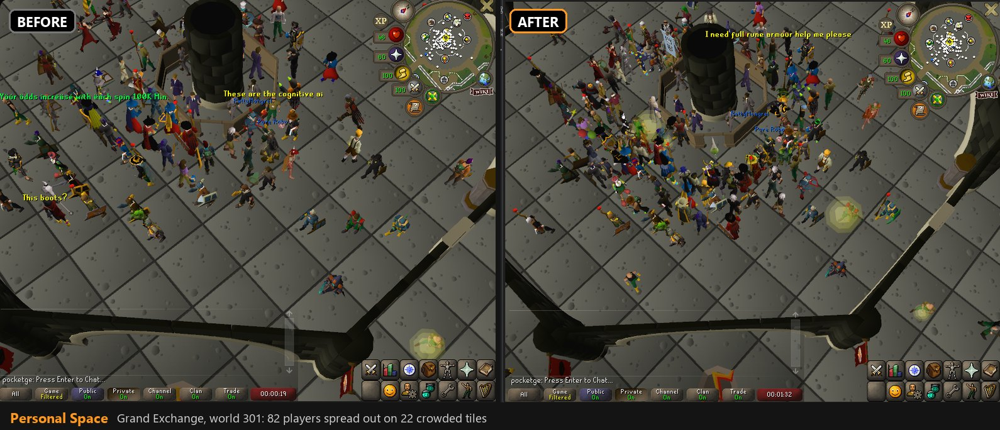
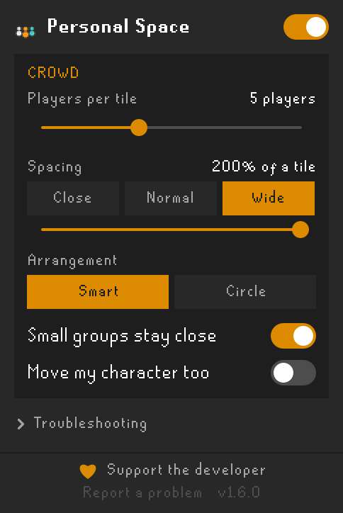

# Personal Space

**See the whole crowd.** When several players stand on the same tile, Old School RuneScape only
draws one of them, so a packed bank, the Grand Exchange, an anvil or a campfire looks half empty.
Personal Space brings everyone back into view and gives them a little room, so every player and
every outfit can be seen.



[](https://buy.stripe.com/aFafZg9ehaaxaVaf3e00000)



## What it does

- **Shows the players the game hides.** Stacked players are drawn again, spread out around their tile.
- **Smart arrangement.** Crowds spread out around their tile, never into a bank booth, stall, anvil
  or wall, and line up side by side at things people face.
- **Players walk into place** with their own walk animation.
- **At an anvil or range**, players form a curve around it and all face it, so nobody ends up
  hitting thin air. Extra players make a second row behind.
- **At a bank counter**, players stay close together in front of the booths instead of forming a
  queue, whatever the spacing slider says.
- **Calm crowds.** Everyone keeps their own spot when people come and go. A spot is held for a few
  seconds for someone who steps away, and only players at the back move forward to fill a gap.
- **Purely cosmetic.** Nobody's real position, clickbox, name, chat or minimap dot changes.
- **Safe by design.** Switches itself off in the Wilderness, in PvP areas, on PvP-type worlds and
  while you're in combat, and never shows players the game itself keeps hidden.

Needs the **GPU** plugin (or 117 HD) turned on.

<br clear="right">

## Using it

Click the **Personal Space** button on RuneLite's right-hand toolbar.

| Setting | What it does |
| --- | --- |
| On/off switch | Spread out crowds, or show the game as normal. |
| Players per tile | How many players on one tile get their own spot: 2 to 10, with 5 as the sweet spot. |
| Spacing | Close, Normal or Wide, or drag the slider up to two tiles apart. Changes show live. |
| Arrangement | **Smart** lines people up at things they're facing and rings everyone else. **Circle** always uses rings. |
| Move my character too | Off: you stay put and others step around you. |
| Troubleshooting | What Personal Space is doing right now, test mode, live checks and a **Copy report** button for bug reports. |

If crowds aren't spreading, open **Troubleshooting**: the status at the top says why (for example
the GPU plugin is off, or you're in a PvP area) and what to do.

## Support the developer

Personal Space is free, and it will stay free. If it made your world feel busier, here's how to
help it keep improving:

- **[Tip the developer](https://buy.stripe.com/aFafZg9ehaaxaVaf3e00000)** through Stripe. Any amount helps.
- **Star this repository** on GitHub so more players find it.
- **Share screenshots** of a busy world with Personal Space on.
- **Report a problem** or suggest an idea in [Issues](https://github.com/grant9008/personal-space/issues).
  Pressing **Copy report** under Troubleshooting and pasting it in helps a lot.

## How it works

The game adds players to the scene every frame, and when several stand still in the exact middle
of one tile it only adds the first. Personal Space sits in front of the GPU renderer
(`DrawCallbacks`): when the game draws that first player, it also draws the others on the tile at
their spots, using each player's own current model, animation and facing.

To make sure it only ever draws players the game is willing to show (and never, say, an invisible
moderator), it watches RuneLite's render callback, which only sees players the game has already
decided to draw. Players stacked behind someone are briefly let through one at a time to be
confirmed; the frame looks identical while this happens.

Everything is public RuneLite API. No reflection, nothing saved about other players, nothing sent
anywhere.

### Known limits

- **Spell and emote graphics** (for example High Alchemy) still appear at the middle of the tile.
- Players busy with an emote or action (sitting, smithing) slide into place instead of walking, so their action isn't interrupted.
- If **Entity Hider** hides every relevant player, the status may wrongly turn red.
- Players past the "players per tile" limit stay hidden in the middle, as in the normal game.

## Development

- **Run Dev Client.bat**, or in IntelliJ the **Run Dev Client** configuration, starts RuneLite with the plugin loaded.
- **Check Build.bat** compiles and runs the unit tests.
- Java 11. `.github/workflows/build.yml` builds on every push.

```
src/main/java/com/grant9008/personalspace/
  PersonalSpacePlugin.java      plugin entry: safety rules, per-tick layout, sidebar updates
  SpreadingDrawCallbacks.java   sits in front of the renderer; draws players at their spots
  StackProbe.java               confirms players are ones the game is willing to draw
  StackSpreader.java            starting spots per tile (circle or side by side)
  CrowdLayout.java              Smart arrangement: settles the whole crowd
  CollisionTerrain.java         where a player can stand, from the game's walkability map
  StackRegistry.java            which players share each crowded tile
  StillnessTracker.java         "is this player standing still"
  OffsetTable.java              current offsets, walking and gliding
  PersonalSpacePanel.java       the sidebar
  StatusSummary.java, Snapshot.java   status line, live checks and report
  PersonalSpaceConfig.java      settings
```
